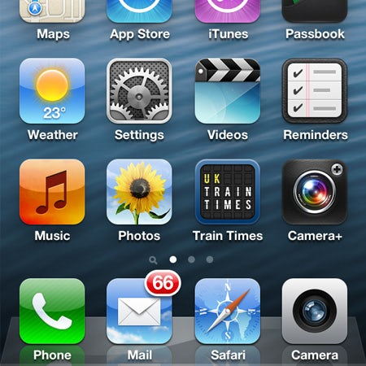
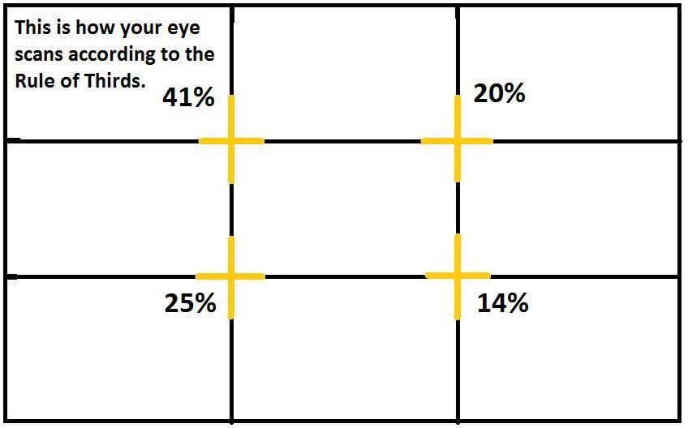
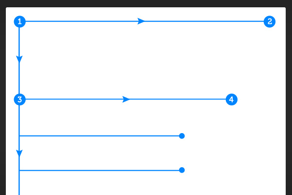
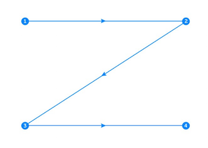

## CONTRIBUTORS:

- [Alex Leon](https://github.com/aleon510)
- [Jernice Duncan](https://github.com/jerniceduncan)
- [Danny Kebede](https://github.com/dannythedeveloper1)

# [Google Slides](https://docs.google.com/presentation/d/1OpKDHqTLcUz6mUfraPyVMMJp_1bqGsjibXElK8GWCmw/edit?usp=sharing)

# General UI Principles:

1. Meet the user’s needs throughout the design process.
2. Know where you are in the design process: 
- Ideation -> Concept Validation -> refinement -> Usability
- Sketch -> Wireframe -> prototype -> Design
3. Have a clear hierarchy: Ensure smooth navigation throughout a design.
4. Keep it consistent: Consistency throughout the website and even other products by the same brand.
5. Understand accessibility: Make sure that your design is usable for as many people as possible.
6. Context is key: How to make it easy for your user - have them in mind. (ex. Is your user on the go? Or sitting at a desk?)
7. Usability First: Test -> Research -> Design -> Prototype -> Build -> Test
8. Less is more: Aim for simplicity.
9. Use Simple Language: Simplicity is the best visual design.
10. Typography is Powerful: Equally as important as your words is your design typography.
11. Feedback Matters
12. Confirm before you commit
13. The user is in control: User control focuses on greater flexibility of use and better control of where a user is with a design or product.
14. Design with personality: adding personality to your design gives it a human touch.
15. Visual grammar: Visual grammar consists of everything that makes up the visual elements of a design: icons, illustrations, patterns, and more.
16. Narrative design: telling a story with your design.

https://www.springboard.com/blog/design/ux-design-principles/

# Resources

### Neumorphism, or Soft UI:
is a visual style that combines background colors, shapes, gradients, highlights, and shadows to ensure graphic intense buttons and switches. All that allows achieving a soft, extruded plastic look, and almost 3D styling.

Pros:
Accessibility

Cons:
Components as buttons and not cards

https://opengeekslab.com/blog/neumorphism-the-next-big-thing-ui-design/

https://www.youtube.com/watch?v=gZGH7xDG6Ms&amp;ab_channel=MasrulWijaya

https://uxplanet.org/neumorphism-in-user-interface-tutorial-c353698ac5c0

### UI/ UX
https://www.interaction-design.org/literature/article/what-is-interaction-design

https://www.nngroup.com/articles/ia-vs-navigation/#:~:text=The%20information%20architecture%20%28IA%29%20is%20not%20part%20of,the%20nngroup.com%20site%20and%20the%20relationship%20between%20them.

https://www.secretstache.com/blog/ui-ux-research-methods/ 
https://mockitt.wondershare.com/graphic-design/graphic-illustration.html 
https://mockitt.wondershare.com/web-design/website-layout.html 

### GlassMorphism:
- the use of partially transparent “glass panels” on a colorful, blurred background.
- 3D interface

https://www.freecodecamp.org/news/glassmorphism-design-effect-with-html-css/

### Flat Design, aka Flat UI:

- a style that emphasizes on readability, cleanliness, and minimalism. Make efficient use of space, and are flat, most famously 
- 2D interface

### Material (made by Google): 
-  Material-UI, a library able to  build your own design system.
- Minimalism
- Convenience
- Personalization
  
https://material-ui.com/

### Material Design has a set of strict visual guidelines. For example:
- No two pieces of Material can overlap.
- All Material elements are opaque.
- No Material elements can fold or bend.

### Skeuomorphism:
- The term “skeuomorph” comes from the Greek: “skéuos” (meaning container or tool) and “morphḗ” (meaning shape). So, what does it mean to contain a shape?
 - a design that emulates familiar materials to invoke a sense of familiarity or comfort in consumers.

   

https://99designs.com/blog/trends/skeuomorphism-flat-design-material-design/

### Gold Rule of Thirds

https://www.interaction-design.org/literature/article/the-rule-of-thirds-know-your-layout-sweet-spots

### F layout design:
- A form of layout design that uses an “F” pattern that relies upon eyetracking.
- Visitors start at the top left of the page.
- Then they scan the top of the site (navigation, subscription, search, etc.)
- Next they move down, reading the next full row of content... all the way to the sidebar.
- Lastly, surfers enter a "scanning pattern" once they hit the bulk of the site content.

### How it works:

- The F-Layout works because it allows web-surfers to scan content naturally. 
- The layout feels comfortable because people have been reading top to bottom, left to right for their entire lives.

https://webdesign.tutsplus.com/articles/understanding-the-f-layout-in-web-design--webdesign-687

### Z layout design:
- The Z layout traces the route the human eye travels when they read — left to right, top to bottom.

https://instapage.com/blog/z-pattern-layout

